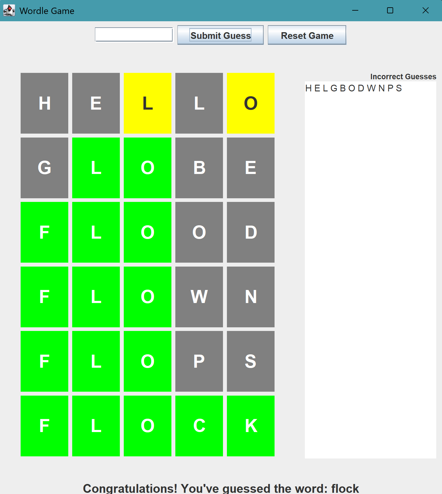

# Wordle Game

A Java implementation of the popular word-guessing game Wordle, created for Introduction to Software Design.

## About the Game

Wordle challenges players to guess a random 5-letter word in six attempts or fewer. After each guess, the game provides feedback:

- 🟩 **Green**: Correct letter in the correct position
- 🟨 **Yellow**: Correct letter in the wrong position
- ⬜ **Gray**: Letter not in the target word

## Features

- Interactive graphical user interface built with Java Swing
- Color-coded feedback for each guess
- Running list of incorrect letters
- Word validation and error handling
- Option to reset the game and start over

## Project Structure

- `WordleGameLogic.java`: Core game mechanics and rules
- `WordleGUI.java`: User interface components
- `WordleInputHandler.java`: Communication between UI and game logic
- `WordleGuess.java`: Representation of player guesses and results
- `WordList.java`: Dictionary of potential target words

## Screenshot

## Author

Blake Kellison

## Acknowledgments

- Created as a project for Introduction to Software Design
